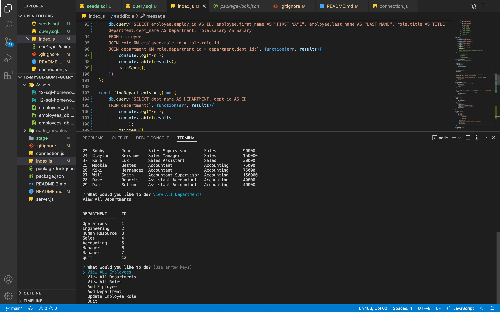

# 12-mySQL-Mgmt-query
This is a mySQL project using various queries to obtain relative information.

## Table of Contents
- [Project Description](#project-description)
- [Screenshot](#screenshot)
- [Run the Project](#run-the-project)
- [Video Link](#video-link)
- [Credits](#credits)
- [License](#license)
- [Contact Me](#contact-me)

## Project Description
The Unit 12 mySQL Management Query project is a node.js command line project to create a query for a Manager to gather and change information for their company.  I used node.js to start the inquirer list of questions.  The User prompts what they would like to do, View All Employees, Departments or Roles.  The User can also Add a Department, Role or another Employee.  

## Screenshot

## Run the Project
The query is ran through node.js with node index.js or npm start to run the prompt questions.  Each prompt has a JavaScript function to run the mySQL queries to obtain the User wanted information.  

## Video Link
[Video Link]()

## Credits
A HUGE Shout Out to TA Veronica for helping me reconfigure my computer AND a great startup.  I would also need to recognize John H for the help on the add functions and the rest of the Discord UCF chat group.  

## License
No licenses needed.

## Contact Me
- [Github Project Link](https://github.com/CanRo2B/12-mySQL-Mgmt-query)
- [CanRo2B Github Link](https://github.com/CanRo2B)
- [Email](mailto:hofe36@hotmail.com)
